# 🗄️ Database Schema Documentation

**Dự án:** Hệ thống Chấm Công (Cham-Cong)  
**Ngày cập nhật:** 2026-02-07 08:45  
**Version:** 2.0 (Employment Types & Leave Management)

---

## 📊 Entity Relationship Diagram

```mermaid
erDiagram
    profiles ||--o{ employee_default_schedules : "has schedules"
    profiles ||--o{ leave_requests : "submits leaves"
    profiles ||--o{ leave_requests : "approves leaves"
    profiles ||--o{ daily_work_summary : "has summaries"
    profiles }o--|| roles : "has role"
    
    leave_requests ||--o{ audit_logs : "triggers audit"
    
    profiles {
        uuid id PK
        string email
        string full_name
        string phone
        string avatar_url
        uuid role_id FK
        string employment_type "NEW: full-time, part-time, intern"
        timestamp created_at
        timestamp updated_at
    }
    
    roles {
        uuid id PK
        string name
        string display_name
        text_array permissions
        boolean is_system_role
    }
    
    employee_default_schedules {
        uuid id PK
        uuid employee_id FK
        integer day_of_week "0-6 (Sun-Sat)"
        string shift_type "morning, evening, full, custom"
        time custom_start_time
        time custom_end_time
        boolean is_template
        timestamp created_at
        timestamp updated_at
    }
    
    leave_requests {
        uuid id PK
        uuid employee_id FK "NEW: migrated from user_id"
        date leave_date
        string leave_type "NEW: full_day, half_day_morning, half_day_afternoon, partial"
        time start_time "NEW"
        time end_time "NEW"
        decimal duration_hours "NEW"
        text reason
        string status "pending, approved, rejected, cancelled"
        uuid approved_by FK "NEW"
        timestamp approved_at "NEW"
        text rejection_reason "NEW"
        timestamp created_at
        timestamp updated_at "NEW"
    }
    
    daily_work_summary {
        uuid id PK
        uuid employee_id FK
        date work_date
        string employment_type
        time scheduled_start_time
        time scheduled_end_time
        decimal scheduled_hours
        time clock_in_time
        time clock_out_time
        decimal clocked_hours
        decimal total_leave_hours
        boolean has_full_day_leave
        jsonb leave_details
        decimal actual_working_hours
        decimal payable_hours
        timestamp calculated_at
        boolean needs_recalculation
    }
    
    company_schedule_config {
        uuid id PK
        string config_key
        jsonb config_value
        text description
        timestamp created_at
        timestamp updated_at
    }
    
    audit_logs {
        uuid id PK
        uuid user_id
        string action
        string resource_type
        uuid resource_id
        jsonb details
        timestamp created_at
    }
```



---

## 📋 Core Tables

### 1. `profiles` (Main Employee Table)

**Mô tả:** Lưu trữ thông tin nhân viên/người dùng trong hệ thống

| Column | Type | Constraints | Description |
|--------|------|-------------|-------------|
| `id` | UUID | PK | Primary key (links to auth.users) |
| `email` | VARCHAR | UNIQUE, NOT NULL | Email đăng nhập |
| `full_name` | VARCHAR | NOT NULL | Họ và tên |
| `phone` | VARCHAR | | Số điện thoại |
| `avatar_url` | TEXT | | URL ảnh đại diện |
| `role_id` | UUID | FK → roles.id | Vai trò của nhân viên |
| `employment_type` | VARCHAR(20) | DEFAULT 'full-time' | ⭐ **NEW**: Loại nhân viên (full-time, part-time, intern) |
| `manager_id` | UUID | FK → profiles.id | Quản lý trực tiếp |
| `created_at` | TIMESTAMP | DEFAULT NOW() | |
| `updated_at` | TIMESTAMP | DEFAULT NOW() | |

**Indexes:**
- `idx_profiles_role` on `role_id`
- `idx_profiles_employment_type` on `employment_type`

**RLS Policies:**
- Users can view their own profile
- Admins and HR can view all profiles

---

### 2. `roles` (Permission System)

**Mô tả:** Quản lý vai trò và quyền hạn

| Column | Type | Constraints | Description |
|--------|------|-------------|-------------|
| `id` | UUID | PK | Primary key |
| `name` | VARCHAR | UNIQUE, NOT NULL | Tên role (admin, hr, member, etc.) |
| `display_name` | VARCHAR | NOT NULL | Tên hiển thị |
| `description` | TEXT | | Mô tả vai trò |
| `is_system_role` | BOOLEAN | DEFAULT false | Role hệ thống (không xóa được) |
| `permissions` | TEXT[] | NOT NULL | Mảng permissions |

**Default Roles:**
- `admin`: Toàn quyền (permissions: ['*'])
- `hr`: Quản lý nhân sự
- `manager`: Quản lý team
- `member`: Nhân viên thường

---

## 🆕 Employment & Schedule Tables

### 3. `employee_default_schedules` (NEW)

**Mô tả:** Lịch làm việc mặc định theo tuần cho từng nhân viên

| Column | Type | Constraints | Description |
|--------|------|-------------|-------------|
| `id` | UUID | PK | Primary key |
| `employee_id` | UUID | FK → profiles.id, NOT NULL | ID nhân viên |
| `day_of_week` | INTEGER | CHECK (0-6), NOT NULL | Thứ trong tuần (0=CN, 6=T7) |
| `shift_type` | VARCHAR(20) | NOT NULL | Loại ca: morning, evening, full, custom |
| `custom_start_time` | TIME | | Giờ bắt đầu custom (nếu shift_type=custom) |
| `custom_end_time` | TIME | | Giờ kết thúc custom (nếu shift_type=custom) |
| `is_template` | BOOLEAN | DEFAULT true | Lặp lại hàng tuần |
| `created_at` | TIMESTAMP | DEFAULT NOW() | |
| `updated_at` | TIMESTAMP | DEFAULT NOW() | |

**Constraints:**
- UNIQUE(employee_id, day_of_week) - Mỗi nhân viên chỉ có 1 schedule/ngày

**Indexes:**
- `idx_default_schedules_employee` on `employee_id`
- `idx_default_schedules_day` on `day_of_week`

**Shift Types:**
- `morning`: 08:30 - 12:30 (4 giờ)
- `evening`: 13:30 - 18:00 (4.5 giờ)
- `full`: 08:30 - 18:00 (9 giờ, trừ 1h nghỉ trưa = 8h)
- `custom`: Tự định nghĩa

**RLS Policies:**
- Employees can view their own schedules
- HR/Admin can view and modify all schedules

---

### 4. `leave_requests` (UPDATED)

**Mô tả:** Quản lý nghỉ phép (đã nâng cấp hỗ trợ partial leave)

| Column | Type | Constraints | Description |
|--------|------|-------------|-------------|
| `id` | UUID | PK | Primary key |
| `employee_id` | UUID | FK → profiles.id, NOT NULL | ⭐ ID nhân viên (migrated from user_id) |
| `leave_date` | DATE | NOT NULL | Ngày nghỉ |
| `leave_type` | VARCHAR(30) | NOT NULL | ⭐ **NEW**: Loại nghỉ phép |
| `start_time` | TIME | | ⭐ **NEW**: Giờ bắt đầu (cho partial leave) |
| `end_time` | TIME | | ⭐ **NEW**: Giờ kết thúc (cho partial leave) |
| `duration_hours` | DECIMAL(4,2) | | ⭐ **NEW**: Số giờ nghỉ |
| `reason` | TEXT | | Lý do nghỉ |
| `image_url` | TEXT | | URL ảnh minh chứng |
| `status` | VARCHAR(20) | DEFAULT 'pending' | pending, approved, rejected, cancelled |
| `approved_by` | UUID | FK → profiles.id | ⭐ **NEW**: Người duyệt |
| `approved_at` | TIMESTAMP | | ⭐ **NEW**: Thời gian duyệt |
| `rejection_reason` | TEXT | | ⭐ **NEW**: Lý do từ chối |
| `created_at` | TIMESTAMP | DEFAULT NOW() | |
| `updated_at` | TIMESTAMP | DEFAULT NOW() | ⭐ **NEW** |

**Leave Types:**
- `full_day`: Nghỉ cả ngày
- `half_day_morning`: Nghỉ buổi sáng (4 giờ)
- `half_day_afternoon`: Nghỉ buổi chiều (4 giờ)
- `partial`: Nghỉ một khoảng thời gian tùy chỉnh (VD: 9h30-14h)

**Indexes:**
- `idx_leave_requests_employee` on `employee_id`
- `idx_leave_requests_date` on `leave_date`
- `idx_leave_requests_status` on `status`
- `idx_leave_requests_approved_by` on `approved_by`

**Triggers:**
- `log_leave_approval_trigger`: Tự động log vào audit_logs khi leave được approve/reject

**RLS Policies:**
- Employees can view/create/update (pending only) their own requests
- Managers can view all and approve/reject requests

---

### 5. `daily_work_summary` (NEW)

**Mô tả:** Tổng hợp dữ liệu làm việc hàng ngày (cho payroll calculation)

| Column | Type | Constraints | Description |
|--------|------|-------------|-------------|
| `id` | UUID | PK | Primary key |
| `employee_id` | UUID | FK → profiles.id, NOT NULL | ID nhân viên |
| `work_date` | DATE | NOT NULL | Ngày làm việc |
| `employment_type` | VARCHAR(20) | | Loại nhân viên (snapshot) |
| **Schedule Info** ||||
| `scheduled_start_time` | TIME | | Giờ bắt đầu theo lịch |
| `scheduled_end_time` | TIME | | Giờ kết thúc theo lịch |
| `scheduled_hours` | DECIMAL(4,2) | | Số giờ làm theo lịch |
| **Actual Attendance** ||||
| `clock_in_time` | TIME | | Giờ clock in thực tế |
| `clock_out_time` | TIME | | Giờ clock out thực tế |
| `clocked_hours` | DECIMAL(4,2) | | Số giờ đã clock |
| **Leave Info** ||||
| `total_leave_hours` | DECIMAL(4,2) | DEFAULT 0 | Tổng giờ nghỉ phép |
| `has_full_day_leave` | BOOLEAN | DEFAULT false | Có nghỉ cả ngày không |
| `leave_details` | JSONB | | Chi tiết các leave trong ngày |
| **Final Calculation** ||||
| `actual_working_hours` | DECIMAL(4,2) | | Giờ làm thực tế = clocked - leave |
| `payable_hours` | DECIMAL(4,2) | | Giờ được trả lương (bao gồm leave) |
| **Metadata** ||||
| `calculated_at` | TIMESTAMP | DEFAULT NOW() | Thời gian tính toán |
| `needs_recalculation` | BOOLEAN | DEFAULT false | Cần tính lại không |

**Constraints:**
- UNIQUE(employee_id, work_date)

**Indexes:**
- `idx_daily_summary_employee` on `employee_id`
- `idx_daily_summary_date` on `work_date`
- `idx_daily_summary_employee_date` on `(employee_id, work_date)`
- `idx_daily_summary_needs_recalc` on `needs_recalculation` WHERE needs_recalculation = true

**RLS Policies:**
- Employees can view their own summaries
- HR/Admin can view all summaries
- System (service_role) can insert/update all

---

### 6. `company_schedule_config` (NEW)

**Mô tả:** Cấu hình lịch làm việc chung của công ty

| Column | Type | Constraints | Description |
|--------|------|-------------|-------------|
| `id` | UUID | PK | Primary key |
| `config_key` | VARCHAR(50) | UNIQUE, NOT NULL | Key cấu hình |
| `config_value` | JSONB | NOT NULL | Giá trị (JSON) |
| `description` | TEXT | | Mô tả |
| `created_at` | TIMESTAMP | DEFAULT NOW() | |
| `updated_at` | TIMESTAMP | DEFAULT NOW() | |

**Default Configs:**

```json
{
  "default_fulltime_hours": {
    "start": "08:30",
    "end": "18:00",
    "break_start": "12:30",
    "break_end": "13:30"
  },
  "default_morning_shift": {
    "start": "08:30",
    "end": "12:30"
  },
  "default_evening_shift": {
    "start": "13:30",
    "end": "18:00"
  }
}
```

---

## 🔧 Helper Functions

### `calculate_leave_duration()`

**Signature:**
```sql
calculate_leave_duration(
  p_leave_type VARCHAR,
  p_start_time TIME,
  p_end_time TIME,
  p_scheduled_hours DECIMAL
) RETURNS DECIMAL
```

**Mô tả:** Tính số giờ nghỉ phép dựa trên loại nghỉ

**Logic:**
- `full_day`: return `p_scheduled_hours`
- `half_day_morning` / `half_day_afternoon`: return `p_scheduled_hours / 2`
- `partial`: return `(p_end_time - p_start_time)` in hours

**Example:**
```sql
SELECT calculate_leave_duration('partial', '09:30', '14:00', 8.0);
-- Returns: 4.50
```

---

### `check_user_permission()`

**Signature:**
```sql
check_user_permission(user_id UUID, required_permission TEXT) RETURNS BOOLEAN
```

**Mô tả:** Kiểm tra user có permission cụ thể không

**Logic:**
1. Lấy permissions từ role của user
2. Check wildcard `*`
3. Check exact match
4. Check resource wildcard (VD: `users.*`)

---

## 🔐 Row Level Security (RLS)

Tất cả các bảng đều bật RLS và có policies riêng:

### General Pattern:
- **Self-access**: Users xem/sửa data của chính mình
- **Admin/HR access**: Admin và HR có full access
- **Manager access**: Manager có access hạn chế (view team, approve leaves)

### Important Notes:
- Service role key bypass RLS (dùng cho background jobs)
- RLS policies JOIN với bảng `roles` để check permissions
- Sử dụng `auth.uid()` để lấy current user ID

---

## 📊 Data Flow

### 1. Employee Type Workflow

```
HR sets employment_type on profile
    ↓
System determines schedule requirements:
    - full-time → Không cần đăng ký ca (auto schedule)
    - part-time → Set default morning/evening shifts
    - intern → Flexible, tự chọn ca
    ↓
Schedule stored in employee_default_schedules
    ↓
Background job generates weekly shifts/reminders
```

### 2. Leave Request Workflow

```
Employee submits leave_request
    ↓
Manager approves/rejects
    ↓
Trigger logs to audit_logs
    ↓
Daily job calculates daily_work_summary
    ↓
Summary used for payroll calculation
```

### 3. Daily Work Summary Calculation

```
Daily Cron Job (00:30):
    FOR each employee:
        1. Get schedule from employee_default_schedules
        2. Get attendance (clock in/out)
        3. Get approved leaves
        4. Calculate:
           - clocked_hours = clock_out - clock_in
           - total_leave_hours = sum(approved leaves)
           - actual_working_hours = clocked - leave
           - payable_hours = clocked (includes paid leave)
        5. Store in daily_work_summary
```

---

## 🚨 Migration Notes

### Changes from Previous Schema:

1. **profiles table:**
   - Added `employment_type` column

2. **leave_requests table:**
   - Added `employee_id` (migrated from `user_id`)
   - Added `leave_type`, `start_time`, `end_time`, `duration_hours`
   - Added `approved_by`, `approved_at`, `rejection_reason`
   - Added `updated_at`

3. **New tables:**
   - `employee_default_schedules`
   - `daily_work_summary`
   - `company_schedule_config`

### Migration File:
`supabase/migrations/20260207_employment_types_and_leaves.sql`

---

## 📝 Naming Conventions

- **Table names:** lowercase, plural, snake_case
- **Column names:** lowercase, snake_case
- **Foreign keys:** `{related_table}_id` (VD: `employee_id`, `role_id`)
- **Timestamps:** Always `created_at`, `updated_at` (with triggers)
- **Booleans:** Prefix `is_`, `has_`, `needs_`

---

## 🔄 Maintenance

### Regular Tasks:

1. **Daily:**
   - Run `calculate_daily_summary` cron job
   - Clean up old notification logs

2. **Weekly:**
   - Generate next week's shifts from templates
   - Send reminder notifications

3. **Monthly:**
   - Archive old daily_work_summary (older than 6 months)
   - Review and update company_schedule_config if needed

### Backup Strategy:

- Supabase automatic backups: Daily
- Critical tables: `profiles`, `leave_requests`, `daily_work_summary`
- Before major migrations: Manual snapshot

---

**⚠️ IMPORTANT:**
- Luôn dùng `profiles` table, KHÔNG phải `employees`
- Check RLS policies trước khi query từ client
- Dùng service_role key cho background jobs
- Test migrations trên staging trước khi apply production

**Last Updated:** 2026-02-07 08:45 by Tiger
